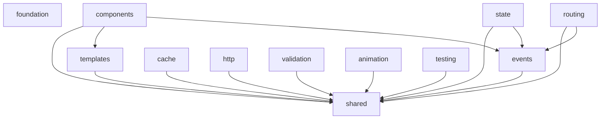

# 🧹 BRUTAL V5 - Packages Purification Plan

## 🎯 Vision: Clean, Aligned, No Loss

### Core Principles for Purification:
1. **Composition over inheritance** - No more class extends
2. **Full as default, minimal as option** - Clear usage pattern
3. **Strict dependency graph** - No violations
4. **One source of truth** - No duplicate implementations
5. **Zero runtime dependencies** - Maintained

## 📐 Optimal Final Architecture

```
packages/@brutal/
├── foundation/          # [6KB] Core utilities, config, polyfills
├── shared/              # [4KB] DOM, utils, errors (composition helpers)
├── events/              # [5KB] Event system (functional)
├── templates/           # [7KB] Template engine
├── components/          # [8KB] Component factory (composition-based)
├── state/               # [6KB] State management
├── routing/             # [6KB] SPA router
├── cache/               # [5KB] Caching layer
├── http/                # [4KB] Fetch wrapper
├── validation/          # [4KB] Schema validation
├── animation/           # [5KB] Animation engine
├── testing/             # [3KB] Test utilities
└── enhanced/            # Extended features (separate repo?)
    ├── components/
    ├── routing/
    └── state/
```

## 🧹 Purification Strategy by Package

### 1. **@brutal/foundation** ✅ (Already minimal)
```
Current: Has minimal.ts
Action: Keep as is, it's already clean
```

### 2. **@brutal/shared** 🔴 (Needs minimal + composition utilities)
```
Current: 13KB, no minimal
Action: 
- Create minimal.ts with essential utils
- ADD composition helpers here:
  - compose()
  - withBehavior()
  - createComponent()
  - mixin()
```

### 3. **@brutal/events** 🔴 (Needs minimal)
```
Current: 16KB, no minimal
Action:
- Create minimal.ts with core EventEmitter
- Full version keeps bus, delegation, etc.
```

### 4. **@brutal/templates** 🔴 (Too many implementations)
```
Current: 6 implementations!
Action:
- Keep index.ts (full) - merge best features
- Keep minimal.ts - ultra-compact
- DELETE: compiler/, core/, engine/, ultra-minimal.ts
```

### 5. **@brutal/components** 🔴 (Needs composition refactor)
```
Current: Class-based with inheritance
Action:
- Rewrite using composition pattern
- Move base component logic to shared
- Delete BrutalComponent, Component classes
```

### 6. **@brutal/state** ✅ (Clean, just needs organization)
```
Current: Has minimal, some redundancy
Action:
- Keep minimal.ts
- Consolidate store implementations
- Delete store/core.ts
```

### 7. **@brutal/routing** ✅ (Clean, minor cleanup)
```
Current: Has minimal, some redundancy
Action:
- Keep minimal.ts
- Delete router/router.ts
- Clean up subdirectories
```

### 8-12. **Other Core Packages** ✅ (Already clean)
```
cache, http, validation, animation, testing
Action: Minor cleanup only
```

## 🏗️ New Components Architecture (Composition)

### Before (Inheritance):
```typescript
// ❌ OLD - Forces inheritance
export class Component extends HTMLElement { }
export class Button extends Component { }
```

### After (Composition):
```typescript
// ✅ NEW - Composition pattern
// In @brutal/shared
export const compose = (...behaviors) => (element) => 
  behaviors.reduce((el, behavior) => behavior(el), element);

export const withState = (element) => {
  element.state = {};
  element.setState = (updates) => { /* ... */ };
  return element;
};

export const withLifecycle = (element) => {
  element.connectedCallback = () => { /* ... */ };
  return element;
};

// In @brutal/components
export const createComponent = (config) => {
  const element = document.createElement(config.tag || 'div');
  return compose(
    withState,
    withLifecycle,
    withEvents,
    ...config.behaviors
  )(element);
};
```

## 📦 Optimal Package Structure

### Each Core Package:
```
@brutal/[package]/
├── src/
│   ├── index.ts         # Full implementation (default)
│   ├── minimal.ts       # Size-optimized (optional)
│   ├── types.ts         # Shared types
│   └── [feature]/       # Feature subdirectories
├── package.json
├── README.md
└── tsconfig.json
```

### Package.json Template:
```json
{
  "name": "@brutal/[package]",
  "exports": {
    ".": {
      "types": "./dist/index.d.ts",
      "default": "./dist/index.js"
    },
    "./minimal": {
      "types": "./dist/minimal.d.ts",
      "default": "./dist/minimal.js"
    }
  },
  "dependencies": {
    // Only @brutal packages as per dependency graph
  }
}
```

## 🔗 Dependency Graph (Fixed)



## 🗑️ Files to Delete

### Immediate Deletion List:
```bash
# Templates
rm -rf packages/@brutal/templates/src/compiler/
rm -rf packages/@brutal/templates/src/core/
rm -rf packages/@brutal/templates/src/engine/
rm packages/@brutal/templates/src/template/
rm packages/@brutal/templates/src/ultra-minimal.ts  # Merge into minimal.ts

# Components
rm packages/@brutal/components/src/base/BrutalComponent.ts
rm packages/@brutal/components/src/base/Component.ts  # If not used

# State
rm packages/@brutal/state/src/store/core.ts

# Routing
rm -rf packages/@brutal/routing/src/router/

# Enhanced (move to separate repo?)
# Or keep but fix dependency violations
```

## 📝 Migration Steps

### Phase 1: Clean (1 day)
1. Delete all redundant files
2. Consolidate implementations
3. Fix dependency violations in package.json

### Phase 2: Refactor (3-5 days)
1. Add composition utilities to @brutal/shared
2. Rewrite @brutal/components with composition
3. Create minimal.ts for events and shared

### Phase 3: Optimize (2-3 days)
1. Ensure all packages < budget
2. Verify zero dependencies
3. Test all exports work correctly

### Phase 4: Document (1 day)
1. Update all READMEs
2. Create migration guide
3. Document composition patterns

## 🎯 Final State

### What We'll Have:
- **11 core packages** - Each with clear purpose
- **35KB total** - Within budget
- **Composition pattern** - No inheritance
- **Clear exports** - Full by default, minimal optional
- **No redundancy** - One implementation per feature
- **Clean dependencies** - Follows strict graph

### Example Usage After Purification:
```typescript
// Using full (default - readable)
import { createComponent } from '@brutal/components';
import { createStore } from '@brutal/state';
import { compile } from '@brutal/templates';

// Using minimal (opt-in - compact)
import { c } from '@brutal/components/minimal';
import { s } from '@brutal/state/minimal';
import { c as compile } from '@brutal/templates/minimal';
```

## ✅ Success Criteria

1. **No class extends** in core packages (except HTMLElement where required)
2. **Each package has max 2 implementations** (full + minimal)
3. **All dependencies follow the graph**
4. **Total bundle < 35KB**
5. **No duplicate code**
6. **Clear, predictable exports**

## 💡 Key Insight

The purification is not just about deleting files - it's about:
1. **Distilling** the best from all implementations
2. **Organizing** with clear boundaries
3. **Modernizing** with composition patterns
4. **Simplifying** the developer experience

"Sin pérdida" - We keep all valuable functionality, just reorganize it better!