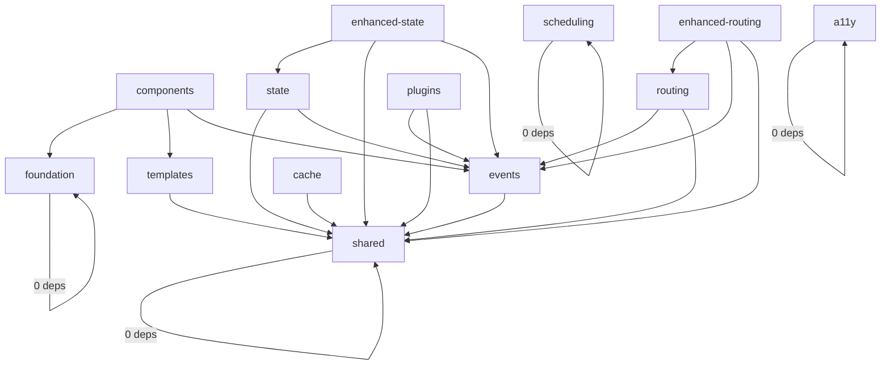

# 🔗 BRUTAL V5 - Dependency Graph

## Purpose
This document defines the exact dependency relationships between packages. No deviations allowed.

## 🎯 Core Principle
**Zero circular dependencies**. The graph is acyclic and enforced by tooling.

## 📊 Visual Dependency Graph



## 📦 Package Dependencies

### Zero Dependencies (Foundation Layer)
```yaml
@brutal/foundation:
  dependencies: []
  
@brutal/shared:
  dependencies: []
  
@brutal/scheduling:
  dependencies: []
  
@brutal/a11y:
  dependencies: []
```

### Single Dependencies
```yaml
@brutal/events:
  dependencies:
    - @brutal/shared
    
@brutal/templates:
  dependencies:
    - @brutal/shared
    
@brutal/cache:
  dependencies:
    - @brutal/shared
```

### Multiple Dependencies
```yaml
@brutal/components:
  dependencies:
    - @brutal/foundation
    - @brutal/templates
    - @brutal/events
    
@brutal/state:
  dependencies:
    - @brutal/shared
    - @brutal/events
    
@brutal/routing:
  dependencies:
    - @brutal/events
    - @brutal/shared
    
@brutal/plugins:
  dependencies:
    - @brutal/events
    - @brutal/shared
```

### Enhanced Packages
```yaml
@brutal/enhanced-state:
  dependencies:
    - @brutal/state
    - @brutal/shared
    - @brutal/events
    
@brutal/enhanced-routing:
  dependencies:
    - @brutal/routing
    - @brutal/events
    - @brutal/shared
```

## 🔍 Dependency Rules

### 1. Foundation Layer
- `foundation`, `shared`, `scheduling`, `a11y` have ZERO dependencies
- They can be built in any order
- They form the base layer

### 2. Service Layer
- `events`, `templates`, `cache` depend only on foundation layer
- They provide core services
- No inter-service dependencies

### 3. Feature Layer
- `components`, `state`, `routing`, `plugins` can depend on multiple packages
- They compose foundation and service layers
- No circular dependencies between features

### 4. Enhanced Layer
- `enhanced-state`, `enhanced-routing` extend core features
- They depend on their core package plus shared services
- Maximum 3 dependencies to maintain simplicity

## 📋 Build Order

Based on dependencies, packages must be built in this order:

### Group 1 (Parallel)
- `foundation`
- `shared`
- `scheduling`
- `a11y`

### Group 2 (Parallel, after Group 1)
- `events`
- `templates`
- `cache`

### Group 3 (Parallel, after Group 2)
- `components`
- `state`
- `routing`
- `plugins`

### Group 4 (Parallel, after Group 3)
- `enhanced-state`
- `enhanced-routing`

## ✅ Validation

### Automated Checks
```javascript
// scripts/validate-dependencies.js
const DEPENDENCY_GRAPH = {
  '@brutal/foundation': [],
  '@brutal/shared': [],
  '@brutal/events': ['@brutal/shared'],
  '@brutal/templates': ['@brutal/shared'],
  '@brutal/components': ['@brutal/foundation', '@brutal/templates', '@brutal/events'],
  '@brutal/state': ['@brutal/shared', '@brutal/events'],
  '@brutal/routing': ['@brutal/events', '@brutal/shared'],
  '@brutal/cache': ['@brutal/shared'],
  '@brutal/scheduling': [],
  '@brutal/a11y': [],
  '@brutal/plugins': ['@brutal/events', '@brutal/shared'],
  '@brutal/enhanced-state': ['@brutal/state', '@brutal/shared', '@brutal/events'],
  '@brutal/enhanced-routing': ['@brutal/routing', '@brutal/events', '@brutal/shared']
};

function validateNoCycles() {
  // Topological sort to detect cycles
  // Fails CI if cycles found
}

function validateDependencies(pkg) {
  const expected = DEPENDENCY_GRAPH[pkg.name];
  const actual = Object.keys(pkg.dependencies || {});
  
  // Ensure exact match
  if (!arraysEqual(expected, actual)) {
    throw new Error(`Invalid dependencies for ${pkg.name}`);
  }
}
```

## 🚫 Anti-Patterns

### ❌ Circular Dependencies
```javascript
// NEVER DO THIS
// @brutal/state depends on @brutal/components
// @brutal/components depends on @brutal/state
```

### ❌ Skip-Level Dependencies
```javascript
// NEVER DO THIS
// @brutal/components directly imports from @brutal/shared/utils
// Must import through proper package boundaries
```

### ❌ Hidden Dependencies
```javascript
// NEVER DO THIS
// Using global variables to share state between packages
// All dependencies must be explicit in package.json
```

## 📐 Architecture Decisions

### Why These Dependencies?

1. **foundation** - True foundation, zero deps
2. **shared** - Utilities everyone needs, zero deps
3. **events** → shared - Events need utilities
4. **templates** → shared - Templates need sanitization
5. **components** → foundation, templates, events - Components compose everything
6. **state** → shared, events - State needs events for reactivity
7. **routing** → events, shared - Routes emit events
8. **cache** → shared - Cache needs utilities
9. **scheduling** - Pure algorithms, zero deps
10. **a11y** - Pure polyfills, zero deps
11. **plugins** → events, shared - Plugins use event system

## 🔄 Adding New Packages

When adding a new package:

1. **Determine layer**
   - Foundation? Zero dependencies
   - Service? One dependency max
   - Feature? Multiple allowed

2. **Update this graph**
   - Add to visual diagram
   - Add to dependency list
   - Update build order

3. **Update validation**
   - Add to DEPENDENCY_GRAPH constant
   - Run validation script

4. **No exceptions**
   - Graph is law
   - Cycles break builds

---

*This dependency graph is enforced by CI/CD. Violations block merges.*