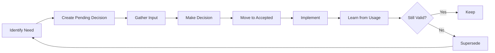

# Pattern: Living Documentation

## Problem
Traditional documentation fails because:
- Gets outdated immediately
- Phase-based docs become irrelevant
- Knowledge gets lost between versions
- No feedback loop from implementation

## Context
Use living documentation when:
- Project evolves continuously
- Learning happens during development
- Decisions need revisiting
- Knowledge must compound

## Solution
Documentation that evolves with the project through structured feedback loops and continuous refinement.

## Implementation

### 1. Foundation Structure
```
foundation/                      # Never "complete"
├── decisions/                   # Decision flow
│   ├── pending/                # Being evaluated
│   ├── accepted/               # Implemented
│   └── superseded/             # Replaced by new learning
├── principles/                  # Slowly evolving core beliefs
├── patterns/                    # Proven solutions
├── standards/                   # Living quality bars
└── learning/                    # Continuous insights
```

### 2. Decision Flow Process


### 3. Pattern Evolution
```markdown
# Pattern: [Name] v2

## Changelog
- v2 (2024-07-12): Added error handling based on production usage
- v1 (2024-07-01): Initial pattern from V4

## Problem
[Updated problem description based on real usage]

## Solution
[Refined solution incorporating learnings]

## Implementation
[Current best practice code]

## Lessons Learned
- What worked well in production
- What needed adjustment
- What to avoid
```

### 4. Continuous Learning Integration
```javascript
// scripts/capture-learning.js
export function captureLearning(insight) {
  const learning = {
    date: new Date().toISOString(),
    category: categorizeInsight(insight),
    description: insight.description,
    impact: insight.impact,
    source: insight.source
  };
  
  // Add to ongoing learning
  fs.appendFileSync(
    'foundation/learning/ongoing/insights.md',
    formatLearning(learning)
  );
  
  // Check if it affects principles
  if (learning.impact === 'principle') {
    createPrincipleReview(learning);
  }
  
  // Check if it affects patterns
  if (learning.category === 'pattern') {
    suggestPatternUpdate(learning);
  }
}
```

### 5. Documentation Lifecycle Hooks
```yaml
# .github/workflows/doc-lifecycle.yml
on:
  pull_request:
    paths:
      - 'packages/**'
      
jobs:
  capture-patterns:
    steps:
      - name: Extract New Patterns
        run: |
          # Analyze PR for recurring solutions
          npm run extract-patterns -- --pr=${{ github.event.number }}
          
      - name: Check Decision Impact
        run: |
          # See if implementation contradicts decisions
          npm run validate-decisions -- --changes=${{ github.event.changes }}
          
      - name: Suggest Documentation Updates
        run: |
          # AI-assisted doc suggestions based on code changes
          npm run suggest-docs -- --diff=${{ github.event.diff }}
```

### 6. No "Phase Complete" Mentality
```javascript
// ❌ OLD: Phase-based
if (phase === 'complete') {
  archiveDocumentation();
  freezeDecisions();
}

// ✅ NEW: Continuous evolution
function updateFoundation(learning) {
  // Everything can be updated based on new learning
  if (learning.affectsPrinciple) {
    updatePrinciple(learning);
  }
  if (learning.supersedesDecision) {
    moveToSuperseded(decision);
    createNewDecision(learning);
  }
  if (learning.improvesPattern) {
    versionPattern(pattern, learning);
  }
}
```

## Key Insights

### 1. Feedback Loops
- Code informs documentation
- Documentation guides code
- Learning improves both

### 2. Version Everything
- Decisions can be superseded
- Patterns can evolve
- Principles change slowly

### 3. Capture at Source
- Document while implementing
- Learn while using
- Refine while maintaining

## Trade-offs

✅ **Benefits**:
- Always current
- Knowledge compounds
- Learning integrated
- Natural evolution

⚠️ **Considerations**:
- Requires discipline
- More complex than static docs
- Need good search/navigation
- Version control important

## Metrics of Success

- **0** outdated documents
- **100%** of learnings captured
- **< 1 week** from insight to integration
- **> 90%** developer satisfaction with docs

## Anti-patterns

### ❌ Freezing Documentation
```markdown
<!-- BAD -->
# Phase 1 Complete ✓
This document is final.

<!-- GOOD -->
# Foundation Status
Last updated: 2024-07-12
Open decisions: 5
Recent learnings: 3
```

### ❌ Separate Documentation Phases
```
<!-- BAD -->
1. Write all docs
2. Implement code
3. Never update docs

<!-- GOOD -->
1. Document pattern
2. Implement with pattern
3. Learn from implementation
4. Update pattern
5. Repeat
```

## Tools and Automation

1. **Learning Capture CLI**
```bash
brutal learn "SharedArrayBuffer needs fallback in Safari"
# Creates: foundation/learning/ongoing/2024-07-12-sab-safari.md
```

2. **Pattern Evolution Tracking**
```bash
brutal pattern evolve component-lifecycle v2
# Creates new version, preserves history
```

3. **Decision Flow Automation**
```bash
brutal decision accept 001-ssr-support
# Moves from pending/ to accepted/
# Updates ARCHITECTURE.md references
```

## References
- V5: Current foundation/ structure
- Inspiration: Linux kernel documentation
- Tools: ADR tools, C4 model

---

*Documentation that doesn't evolve is documentation that lies.*