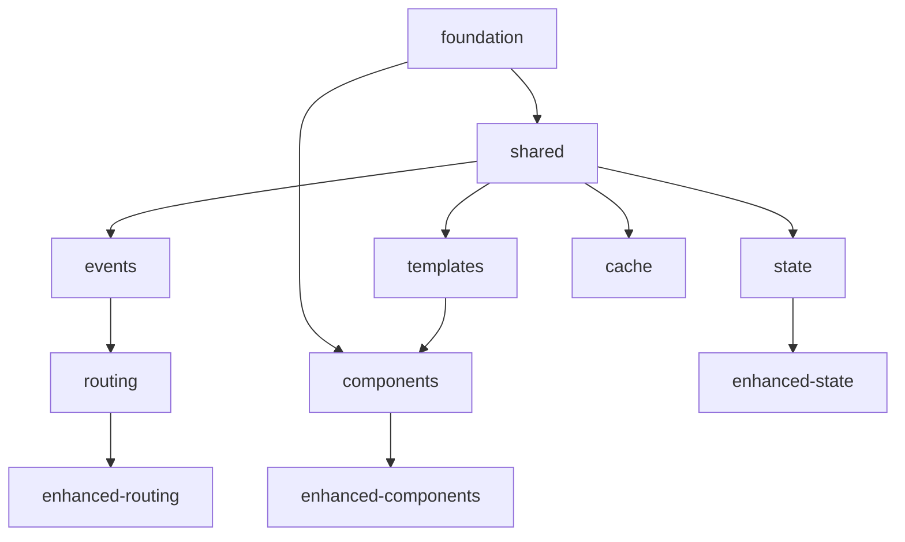

# 🏗️ BRUTAL V5 - Living Architecture

> This is a living document that evolves with the project. For decisions and rationale, see [foundation/decisions](./foundation/decisions/INDEX.md).

> ✅ **Distilled**: 2024-07-12
> - Modular architecture → [pattern](./foundation/patterns/architecture/modular-monorepo.md)
> - Bundle strategy → [pattern](./foundation/patterns/architecture/bundle-composition.md)
> - Core principles → [principles](./foundation/principles/)

## Overview

BRUTAL V5 is a modular, zero-dependency web framework built on Web Standards. This document defines the current architecture, continuously refined from V3's 300+ capabilities and V4's implementation experience.

## Core Principles

- **[Zero Dependencies](./principles/zero-dependencies.md)** - No runtime dependencies, ever
- **[Modular Architecture](./principles/modular-architecture.md)** - Small, focused packages
- **[Automation Over Discipline](./principles/automation-over-discipline.md)** - Quality through tooling
- **[Explicit Over Implicit](./principles/explicit-over-implicit.md)** - No magic, clear behavior
- **[Composition Over Inheritance](./principles/composition-over-inheritance.md)** - Use composition for flexibility and tree-shaking
- **[Feature-Based Structure](./principles/feature-based-structure.md)** - Organize by feature, not file type
- **[One Dependency Rule](./principles/one-dependency-rule.md)** - Enhanced packages depend on only their base

## Package Architecture

### Core Packages (35KB total)
Essential packages that form the foundation:

| Package | Size | Purpose | Dependencies |
|---------|------|---------|--------------|
| @brutal/foundation | 6KB | Polyfills, Registry, Config, Constants | None |
| @brutal/shared | 4KB | Common utilities, errors, DOM helpers | None |
| @brutal/events | 5KB | Event system with emitter | @brutal/shared |
| @brutal/templates | 7KB | Template engine with cache | @brutal/shared |
| @brutal/components | 8KB | Component system with lifecycle management | @brutal/foundation, @brutal/templates, @brutal/events |
| @brutal/state | 6KB | State management + SharedArrayBuffer | @brutal/shared, @brutal/events |
| @brutal/routing | 6KB | SPA routing + history wrapper | @brutal/events, @brutal/shared |
| @brutal/cache | 5KB | Multi-level cache + fingerprinting | @brutal/shared |
| @brutal/scheduling | 3KB | DOM scheduling | None |
| @brutal/a11y | 4KB | Accessibility + ARIA helpers | None |
| @brutal/plugins | 4KB | Plugin system | @brutal/events, @brutal/shared |

### Enhanced Packages (20KB total)
Advanced versions with more features:

| Package | Size | Enhances | Features | Dependencies |
|---------|------|----------|----------|-------------|
| @brutal/enhanced-components | 20KB | components | Async, Portal, Observed | @brutal/components only |
| @brutal/enhanced-state | 20KB | state | Time-travel, DevTools | @brutal/state only |
| @brutal/enhanced-routing | 15KB | routing | Guards, Transitions | @brutal/routing only |

**Important**: Enhanced packages must ONLY import from their base package's public API. No direct imports from @brutal/shared or @brutal/events.

### Extension Packages (100KB total)
Optional feature packages:

| Package | Size | Category | Purpose |
|---------|------|----------|---------|
| @brutal/forms | 12KB | UI | Form handling |
| @brutal/ui-primitives | 20KB | UI | 20+ components |
| @brutal/performance | 10KB | Optimization | V3 performance gems |
| @brutal/gpu | 15KB | Graphics | WebGL acceleration |
| @brutal/animation | 12KB | Motion | Animation system |
| @brutal/mobile | 8KB | Mobile | Touch optimization |
| @brutal/workers | 10KB | Threading | Worker management |
| @brutal/data | 15KB | Data | Grids, virtual scroll |
| @brutal/pwa | 12KB | PWA | Offline, push |
| @brutal/i18n | 8KB | i18n | Internationalization |
| @brutal/security | 6KB | Security | XSS, CSP |
| @brutal/debug | 10KB | DevTools | Debug overlay |
| @brutal/ai | 8KB | AI | Component generation |

## Dependency Graph



## Component Architecture

### Composition Pattern (Required)
The component system uses **composition over inheritance** for scalability:

```typescript
// CORRECT: Composition pattern
export const withLifecycle = (Component) => {
  return class extends Component {
    connectedCallback() {
      super.connectedCallback?.();
      // Lifecycle logic
    }
  };
};

// WRONG: Inheritance pattern (DO NOT USE)
// export abstract class BrutalComponent extends HTMLElement
```

### Lifecycle Management
The component system implements a robust lifecycle with automatic cleanup:

```typescript
// Component storage pattern (pending decision #007)
const componentStates = new WeakMap<Component, State>();
const componentCleanups = new WeakMap<Component, Cleanup[]>();

// Lifecycle hooks (via composition)
connectedCallback()    // Setup and register
disconnectedCallback() // Cleanup and unregister
adoptedCallback()      // Handle document moves
attributeChangedCallback() // Reactive updates
```

**Key Features**:
- **Composition-based architecture** (no inheritance)
- Memory-safe storage with WeakMap (or alternatives per decision)
- Automatic cleanup registry prevents leaks
- Integration with @brutal/scheduling for render optimization
- Error boundaries isolate component failures

### Error Isolation
Each component can act as an error boundary:
- Catches errors in child components
- Prevents cascade failures
- Reports to error handling system
- Allows graceful degradation

## Bundle Strategy

See **[Bundle Composition Pattern](./foundation/patterns/architecture/bundle-composition.md)** for detailed bundle strategy including:
- 5 predefined bundles (lite/core/enhanced/ui/full)
- Custom bundle configuration
- Size budgets and validation
- Import resolution strategies

## Quality Standards

See **[Quality Standards](./foundation/standards/quality/)** for detailed requirements:
- 95% minimum coverage
- Size budgets per package
- Performance requirements
- TypeScript strict mode
- Documentation requirements

### CI/CD Pipeline

Each package has independent:
- Linting (ESLint + Prettier)
- Type checking (TypeScript strict)
- Testing (Jest with coverage)
- Building (Rollup/esbuild)
- Size checking (size-limit)
- Performance testing (benchmarks)

## Architectural Requirements

### Composition Over Inheritance
All packages MUST use composition patterns:
- No abstract classes
- No deep inheritance chains
- Use higher-order functions and mixins
- Enable tree-shaking and modularity

### Package Structure
Each package MUST follow feature-based organization:
```
src/
├── [feature]/
│   ├── [feature].ts
│   ├── [feature].types.ts
│   └── [feature].test.ts
└── index.ts
```

### Dependency Rules
1. Core packages: Zero runtime dependencies
2. Enhanced packages: ONE dependency (their base package)
3. No circular dependencies
4. No internal imports (use public API only)

## Pending Decisions

See [foundation/decisions/pending](./foundation/decisions/pending/) for decisions awaiting input:
- SSR Support Location
- Telemetry Implementation
- Error Package Structure
- SharedArrayBuffer Support
- Template Cache Strategy
- Contribution Model (phases vs continuous)
- Component Storage Pattern (WeakMap vs alternatives)
- Living Documentation Process

## Migration Path

### From V3
1. Feature mapping to new packages
2. Automated migration tool
3. Compatibility layer available

### From V4
1. Direct upgrade path
2. Import path updates only
3. No API changes

## Performance Targets

| Metric | Target | Measurement |
|--------|--------|-------------|
| First Paint | <100ms | Lighthouse |
| TTI | <200ms | Lighthouse |
| Bundle Size | <30KB | gzipped |
| Memory | <10MB | Chrome DevTools |
| FPS | 60fps | Performance API |

## Security Model

1. **CSP by default** - Strict policies
2. **XSS Protection** - Auto-sanitization
3. **CSRF Tokens** - Built-in support
4. **Input Validation** - Type-safe by default

## Browser Support

- Chrome/Edge: Latest 2 versions
- Firefox: Latest 2 versions
- Safari: Latest 2 versions
- Mobile: iOS 14+, Android 8+
- Optional IE11 polyfill package

## Extension Points

1. **Plugin System** - Runtime extensions
2. **Build Plugins** - Compile-time transforms
3. **Custom Elements** - Web standards
4. **Event Hooks** - Lifecycle integration

## Implementation Status

### Current State (2025-07-14)
- **Packages Implemented**: 14/42 (33%)
- **Architecture Compliance**: 60%
- **Composition Pattern**: 10% (needs refactoring)
- **Tests Passing**: 100% (41 unit, 22 e2e)

### Known Issues
1. Using inheritance instead of composition
2. Enhanced packages have internal imports
3. Missing feature directory structure
4. Inconsistent bundle size targets

### Refactoring Priority
1. Convert to composition pattern
2. Remove internal imports
3. Implement feature directories
4. Complete missing implementations

## Future Compatibility

- Web Components v2 ready
- ES2025 modules
- Import maps support
- No breaking changes in minor versions

---

*This architecture is the result of learning from 300+ V3 capabilities and V4 implementation experience. Last updated: 2025-07-14*