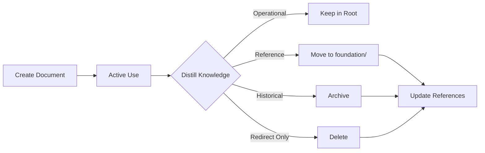

# 📄 Document Lifecycle & Placement Strategy

## Document Categories & Destinations

### 1. ✅ Stay in Root (High Traffic/Operational)
These are entry points and active operational documents:

- **README.md** - Project entry point
- **LICENSE** - Legal requirement  
- **CONTRIBUTING.md** - How to contribute
- **CODE_OF_CONDUCT.md** - Community standards
- **SECURITY.md** - Security policy
- **ARCHITECTURE.md** - Current system design (distilled, with links)
- **ROADMAP.md** - What we're building now

### 2. 📁 Move to foundation/ (Living Reference)
These are part of the continuous evolution:

- **QUALITY-STANDARDS.md** → `foundation/standards/quality/`
- **GOVERNANCE.md** → `foundation/standards/process/`
- **STRUCTURE-CHECKLIST.md** → `foundation/standards/structure/`
- **Pending decisions** → `foundation/decisions/pending/`

### 3. 🗄️ Archive (Historical/Completed)
These served their purpose and are now historical:

- **PHASE-0-*.md** → `foundation/archive/planning/`
- **BUNDLE-MAP.md** → `foundation/archive/` (after full distillation)
- **V5-STRUCTURE-ANALYSIS.md** → `foundation/archive/analysis/`
- **CLEANUP-ANALYSIS.md** → `foundation/archive/analysis/`
- **Old iterations** → `foundation/archive/iterations/`

### 4. ❌ Delete (Temporary/Redirects)
After confirming all references updated:

- **PENDING-DECISIONS.md** (now just a redirect)
- **LESSONS-LEARNED.md** (now just a redirect)
- Other pure redirect files

## Document Lifecycle Flow



## Current Status & Actions Needed

### Documents to Move NOW:
```bash
# Already moved (just need to delete redirects)
rm PENDING-DECISIONS.md  # Just a redirect
rm LESSONS-LEARNED.md    # Just a redirect
rm PHASE-0-FOUNDATION.md # Just a redirect
rm QUALITY-STANDARDS.md  # Just a redirect

# Should be moved to foundation/standards/
mv GOVERNANCE.md foundation/standards/process/
mv STRUCTURE-CHECKLIST.md foundation/standards/structure/
mv MASTER-VALIDATION.md foundation/standards/quality/

# Should be archived
mv DIRECTORY-FINAL.md foundation/archive/planning/
mv BUNDLE-MAP.md foundation/archive/reference/  # Keep for reference
```

### Documents Already in Right Place:
- ✅ All in `foundation/archive/planning/` - Historical planning docs
- ✅ All in `foundation/patterns/` - Extracted patterns
- ✅ All in `foundation/decisions/` - Decision tracking

### Root Directory After Cleanup:
```
brutal-v5/
├── README.md                # Entry point
├── ARCHITECTURE.md          # Current design (slim, with links)
├── ROADMAP.md              # Active development focus
├── LICENSE                 # Legal
├── CONTRIBUTING.md         # How to help
├── CODE_OF_CONDUCT.md      # Community
├── SECURITY.md             # Security
├── foundation/             # All living documentation
├── scripts/                # Tooling
└── [build files]           # package.json, etc (when created)
```

## Decision Criteria

Keep in root if:
1. **First thing people need** (README, LICENSE)
2. **Active/operational** (ARCHITECTURE, ROADMAP)
3. **External requirement** (CONTRIBUTING, SECURITY)

Move to foundation if:
1. **Living standard** (quality, process)
2. **Evolving knowledge** (patterns, principles)
3. **Decision tracking** (pending, accepted)

Archive if:
1. **Historical value** (old plans, analyses)
2. **Completed purpose** (phase docs)
3. **Superseded content** (old versions)

Delete if:
1. **Pure redirect** (no content)
2. **Temporary file** (analysis, cleanup)
3. **No ongoing value** (scratch work)

---

*A clean root shows a mature project.*