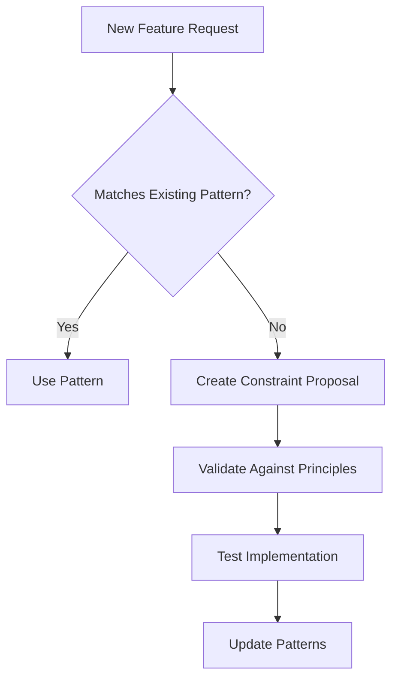

# 🎯 Foundation Realignment Plan
*Making principles enforceable, not just readable*

## 🔍 The Core Problem

We have beautiful principles that we consistently violate. Why? Because:
1. **Principles are suggestions, not constraints**
2. **No automated enforcement**
3. **AI and humans interpret differently**
4. **No feedback when violations occur**

## 🏗️ New Foundation Architecture

### 1. **Executable Principles**

Transform each principle into code that enforces itself:

```typescript
// Not just documentation
"Zero Dependencies"

// But executable constraint
export const ZERO_DEPENDENCIES: Constraint = {
  id: 'zero-dependencies',
  severity: 'error',
  validate: (pkg: Package) => {
    const deps = Object.keys(pkg.dependencies || {});
    const external = deps.filter(d => !d.startsWith('@brutal'));
    return {
      valid: external.length === 0,
      violations: external.map(d => `External dependency: ${d}`)
    };
  }
};
```

### 2. **Decision Framework**

Every decision must be:
- **Codified** - Written as executable rule
- **Automated** - Checked without human intervention
- **Versioned** - Track changes over time
- **Learned** - Update based on violations

```typescript
// decisions/use-composition.ts
export const USE_COMPOSITION: Decision = {
  id: 'use-composition',
  rationale: 'Composition is more flexible than inheritance',
  constraints: [
    NO_CLASS_EXTENDS,
    PREFER_FUNCTION_COMPOSITION,
    MAX_INHERITANCE_DEPTH(1)
  ],
  exceptions: [
    'HTMLElement inheritance for Web Components'
  ],
  enforcement: 'pre-commit'
};
```

### 3. **AI-Human Contract**

Clear rules for both:

```yaml
# .brutal/ai-contract.yaml
ai_constraints:
  never:
    - create_new_principles
    - override_architecture_decisions  
    - ignore_performance_budgets
    - bypass_security_rules
  
  always:
    - validate_against_constraints
    - suggest_within_patterns
    - escalate_uncertainty
    - preserve_decision_history

human_constraints:
  never:
    - override_without_review
    - skip_validation_tools
    - ignore_ai_warnings
    - delete_decision_history
  
  always:
    - review_ai_suggestions
    - document_exceptions
    - update_constraints_when_learned
    - maintain_ai_context
```

## 📋 Systematic Prevention Strategy

### 1. **Pre-Decision Phase**


### 2. **During Development**
- **Every file creation** → Check allowed patterns
- **Every import** → Validate dependencies
- **Every class** → Verify composition
- **Every package** → Measure size

### 3. **Post-Implementation**
- **Learn from violations**
- **Update constraints**
- **Evolve patterns**
- **Document lessons**

## 🛡️ Guardrails Implementation

### Phase 1: Core Constraints (Immediate)
```typescript
// foundation/constraints/index.ts
export const BRUTAL_CONSTRAINTS = {
  dependencies: ZERO_EXTERNAL_DEPS,
  size: MAX_PACKAGE_SIZE(5000), // 5KB
  patterns: APPROVED_PATTERNS,
  architecture: ENFORCE_LAYERS
};

// Git hooks
// .husky/pre-commit
npm run validate:constraints
```

### Phase 2: AI Integration (Week 1)
```typescript
// foundation/ai/boundaries.ts
export const AI_BOUNDARIES = {
  explorationSpace: APPROVED_PATTERNS,
  decisionFramework: CONSTRAINT_BASED,
  escalationTriggers: UNCERTAINTY_THRESHOLD,
  contextPreservation: DECISION_HISTORY
};
```

### Phase 3: Learning System (Week 2)
```typescript
// foundation/learning/index.ts
export class ConstraintEvolution {
  onViolation(violation: Violation) {
    this.patterns.record(violation);
    if (this.patterns.isRecurring(violation)) {
      this.constraints.propose(violation.toException());
    }
  }
}
```

## 🎯 How We Both Avoid This

### For You (Human):
1. **Define clear objectives** before asking for options
2. **Set constraints** when exploring
3. **Make decisions** then stick to them
4. **Review systematically** not randomly
5. **Learn and codify** violations

### For Me (AI):
1. **Always check constraints** before suggesting
2. **Escalate uncertainty** instead of guessing
3. **Preserve context** between sessions
4. **Learn from patterns** not just instructions
5. **Enforce systematically** not selectively

### Our Contract:
```typescript
interface Collaboration {
  human: {
    provides: ['objectives', 'constraints', 'decisions'];
    maintains: ['context', 'learning', 'exceptions'];
  };
  
  ai: {
    provides: ['options_within_constraints', 'validation', 'patterns'];
    maintains: ['consistency', 'memory', 'enforcement'];
  };
  
  both: {
    respect: ['constraints', 'decisions', 'learnings'];
    update: ['patterns', 'exceptions', 'documentation'];
  };
}
```

## 📊 Success Metrics

We'll know this works when:
1. **Zero accidental violations** (all are intentional exceptions)
2. **Decisions stick** (no revisiting without new data)
3. **Patterns emerge** (not prescribed)
4. **Complexity decreases** (not increases)
5. **Shipping accelerates** (not slows)

## 🚀 Immediate Actions

### 1. Create Constraint System
```bash
mkdir -p foundation/constraints
mkdir -p foundation/ai
mkdir -p foundation/validation
```

### 2. Convert First Principle
Start with "Zero Dependencies" - make it executable

### 3. Add Pre-commit Hook
Validate every commit against constraints

### 4. Document AI Boundaries
Create machine-readable constraint file

### 5. Start Learning Loop
Track first violation and learn

---

**The key insight**: Principles without enforcement are wishes. Constraints with automation are reality.