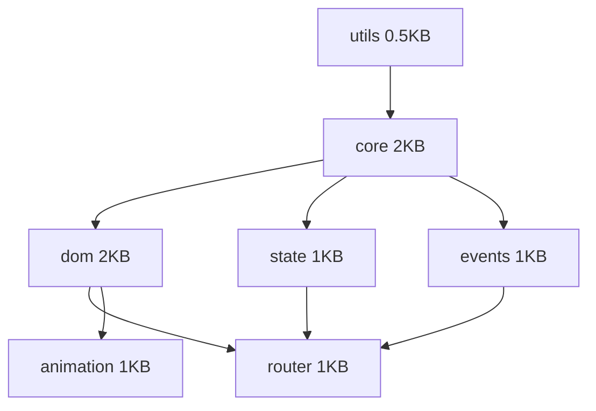

# 📦 V6 Package Structure Design

## Directory Structure
```
brutal-v6/
├── packages/
│   └── @brutal/
│       ├── core/
│       │   ├── package.json
│       │   ├── tsconfig.json
│       │   ├── src/
│       │   │   ├── index.ts         # Exports
│       │   │   ├── compose.ts       # Core composition
│       │   │   ├── behaviors.ts     # withState, withEvents, etc
│       │   │   └── types.ts         # TypeScript types
│       │   ├── dist/               # Built files
│       │   └── examples/
│       │       └── counter.html    # Working example
│       │
│       ├── dom/
│       │   ├── package.json
│       │   ├── src/
│       │   │   ├── index.ts
│       │   │   ├── html.ts          # Template literal processor
│       │   │   ├── render.ts        # DOM rendering
│       │   │   ├── query.ts         # Query helpers
│       │   │   └── manipulate.ts    # DOM manipulation
│       │   └── examples/
│       │
│       ├── state/
│       ├── events/
│       ├── router/
│       ├── animation/
│       └── utils/
│
├── examples/              # Full app examples
│   ├── counter/          # Simplest example
│   ├── todo/             # Classic TODO
│   └── dashboard/        # Complex example
│
├── scripts/              # Build and validation
│   ├── build.js         # Build all packages
│   ├── validate-size.js # Check size constraints
│   └── create-package.js # Package generator
│
└── foundation/          # Already complete
```

## Package Dependencies Graph


## Standard Package Structure

Each package MUST have:
```
package-name/
├── package.json         # Minimal, no external deps
├── tsconfig.json        # Extends root config
├── src/
│   ├── index.ts        # Public API (dual exports)
│   ├── [feature].ts    # One file per feature
│   └── types.ts        # TypeScript definitions
├── dist/
│   ├── index.js        # < 2KB limit
│   └── index.d.ts      # Type definitions
└── examples/
    └── basic.html      # Proves it works
```

## Build Configuration

### package.json Template
```json
{
  "name": "@brutal/[name]",
  "version": "0.0.1",
  "main": "dist/index.js",
  "types": "dist/index.d.ts",
  "files": ["dist"],
  "scripts": {
    "build": "node ../../scripts/build.js",
    "validate": "node ../../scripts/validate-size.js"
  },
  "dependencies": {
    "@brutal/utils": "workspace:*"
  },
  "devDependencies": {}
}
```

### tsconfig.json Template
```json
{
  "extends": "../../../tsconfig.base.json",
  "compilerOptions": {
    "outDir": "./dist",
    "rootDir": "./src"
  },
  "include": ["src/**/*"]
}
```

## Size Budget Allocation

| Package | Budget | Reserved For |
|---------|--------|--------------|
| utils | 500B | debounce(150B), throttle(150B), uid(100B), misc(100B) |
| core | 2048B | compose(200B), withState(600B), withEvents(400B), withLifecycle(300B), withProps(300B), types(248B) |
| dom | 2048B | html(800B), render(600B), query(300B), manipulate(348B) |
| state | 1024B | createStore(400B), subscribe(300B), update(324B) |
| events | 1024B | on(200B), off(200B), emit(300B), delegate(324B) |
| router | 1024B | route(400B), navigate(300B), back(100B), types(224B) |
| animation | 1024B | animate(500B), timeline(300B), ease(224B) |
| **TOTAL** | **8704B** | With 64B buffer |

## Validation Rules

1. **Size**: Each package MUST be under its budget
2. **Dependencies**: Only @brutal/* deps allowed
3. **Exports**: Must follow dual API pattern
4. **Examples**: Must have working example
5. **Types**: Must export TypeScript types

## Next: Design @brutal/core API